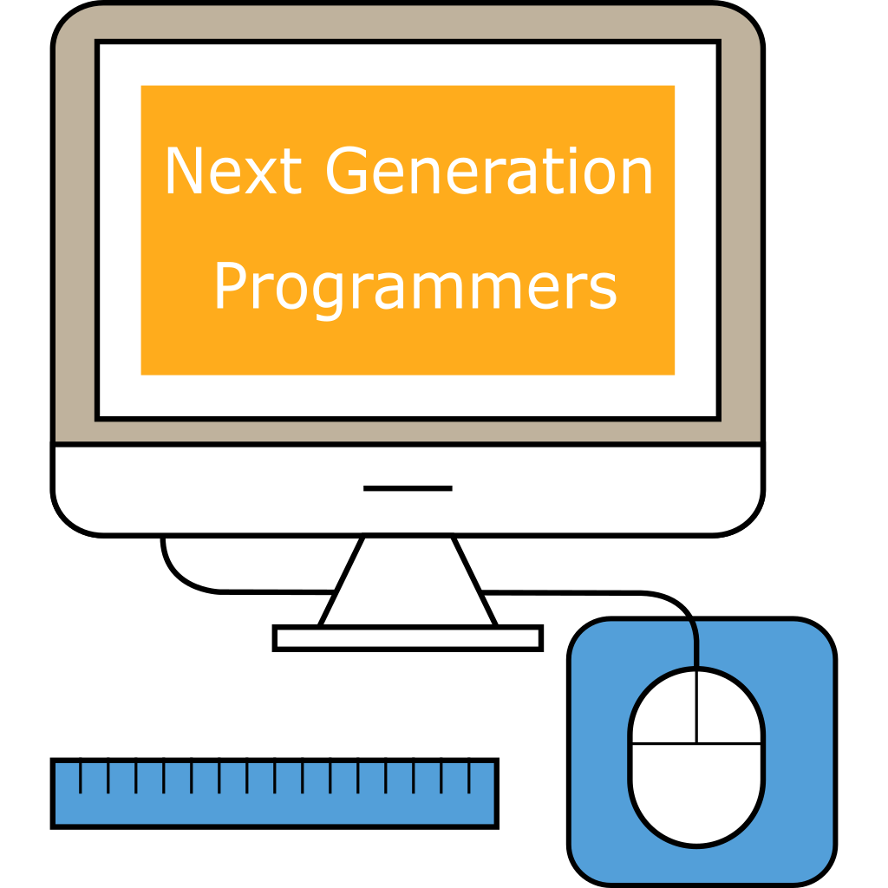

#nexgenprog

Next Generation Programmers (NGP) is a non-profit educational outreach initative 
aimed to inspire young talent from rural schools in developing countries to pursue programming.

 
  

 

<!--  -->
